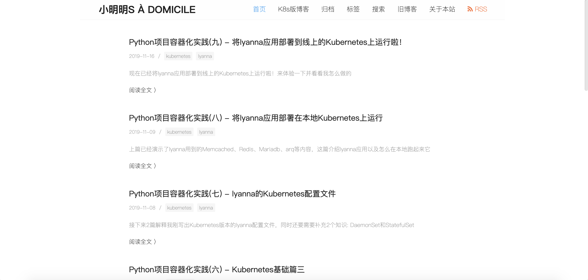

# lyanna

  My Blog Using Sanic

  <a href="https://dongweiming.github.io/lyanna/">查看文档 📖</a>

## Overview

这是一个使用asyncio生态开发的个人技术博客。具体如下：

* Web框架: Sanic
* 模板: Mako/Sanic-Mako
* 数据库: TortoiseORM/aiomysql
* 缓存: aiomcache
* KV数据库: aioredis

其他aio扩展: Sanic-Auth、Sanic-wtf、sanic-session、aiotask-context、asyncblink、sanic-sentry

## Demo

[DEMO](https://blog.pycourses.com)

  

## Features

* 可以通过后台对文章、标签等做增删改查
* 后台支持Markdown编辑/预览
* 支持代码语法高亮
* 支持TOC
* 支持文章搜索
* 支持Github登录评论
* 支持Github登录对文章和平台表态
* 可以分享文章到微信/微博/豆瓣/印象笔记/Linkedin
* 支持Hexo等其他Markdown源文件的导入
* 支持文章的语法高亮
* 可以增加个人设置(设置头像，个人介绍，添加Github等链接)
* 支持定制导航栏
* 支持RSS/Sitemap
* 相关文章推荐(根据相似标签)
* 响应式设计
