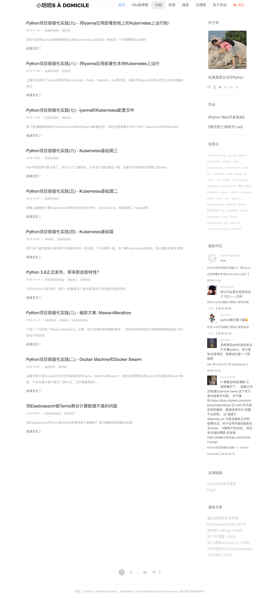

Widget(小部件)功能思路来源于Wordpress，可以在博客的(左/右/上/下)边栏中添加、排列或删除这些部件。通过Widget可以方便自定义设置边栏的内容。

目前lyanna内置了如下6种常用Widget，但是需要使用YAML配置文件设置。项目下包含一个配置模板config.yaml.tmpl，如果你希望侧边栏生效可以:

```bash
➜ cp config.yaml.tmpl config.yaml  # 也就是项目根目录下包含config.yaml这个文件
```

PS: 使用YAML而不是原来的Python配置文件主要是由于Python代码对于描述复杂配置结构表现力太长，直接写JSON可读性差。

## 实际效果

这是写文档时那天我博客使用Widget的效果:



## about_me

这个widget作者的个人介绍，头像、展示社交网站链接等，完整支持的选项如下:

```yaml
partials:
  - name: about_me
    title: 'AboutMe'
    avatar: 'me.jpg'  # = /static/upload/me.jpg  # 头像地址，需要放到项目的static/upload目录下
    intro: '你看到了我哟'  # 个人介绍
    sns:  # 社交列表，列表顺序决定了展示icon的顺序。建议写8个凑满一行
    - twitter: 'example'  # key为社交网站名字，值为网站id或者name
    - github: 'example'
    - douban: 'example'
    - linkedin: 'example'
    - instagram: 'example'
    - stack-overflow: 'example'
    - medium: 'example'
    - zhihu: 'example'
    - email: 'example'
    - wechat: 'wechat-qrcode.jpg'  # 微信和微信公众号放的是二维码图片，同样要放在项目的static/upload目录下
    - weixingongzhonghao: 'wechat-subscription-account-qrcode.png'
```

在设计Widget时使用了局部(Partial)模板这个思路，全部widget都在`partials`项下，通常widget至少包含name(widget模板名字)、title(部件标题)这2项。其它项各不相同，参数作用我已经注释进上面的例子中。

## blogroll

主要可用于友情链接。当然可以发散一下，所有和链接相关的内容都可以使用它。

```yaml
  - name: blogroll
    title: 友情链接
    links:
      - title: '大明大明大明大明大明'
        url: 'https://www.example.com'
      - title: '小明'
        url: 'https://www.example.com'
```

## tagcloud

标签云:

```yaml
  - name: tagcloud
    title: 标签云
    count: 20  # 限制(按标签数量排序后)展示的标签数量，必选
```

## html

可以写纯HTML内容，你可以加任何想要展示的内容，发挥想象力吧:

```yaml
  - name: html
    title: 自定义HTML
    body: |
      <p>Hello <strong>World</strong>!!</p>
```

## latest_comments

最近评论列表:

```yaml
  - name: latest_comments
    title: 最新评论
    count: 5  # 限制最新评论数量，必选
    max_length: 65  # 限制评论内容长度
```

## most_viewed

最热(根据PV)文章列表:

```yaml
- name: most_viewed
    title: '最热文章'
    count: 5  # 限制最热文章数量，必选
```

## 贡献新的Widget

目前只支持侧边栏(sidebar)类型的Widget。

首先添加新的局部模板，如果你希望让这个widget名字是hello，就添加`templates/partials/sidebar/hello.html`，基本内容如下:

```html
<%page args="partial"/>
<section class="widget">
  % if 'title' in partial:
  <h5>${ partial.title }</h5>
  % endif
</section>
```

可以参考现有模板的代码，如果希望变量可配置，直接用`partial.XX`即可。

如果需要修改样式，需要向`static/css/widget.css`文件添加新的CSS代码，但是注意不要影响之前的样式。

如果需要从现有应用模型等数据源获得数据，除了在models里面编写对应的异步函数，还要在`views/blog.py`这个视图文件的`_posts`函数中添加对应的逻辑，这样渲染时就可以利用对应数据了，举个`most_viewed`的实际写法:

```python
@mako.template('index.html')
async def _posts(request, page=1):
    ...
    for partial in partials:
        partial = AttrDict(partial)
        if partial.name == 'most_viewed':
            json.update({
                'most_viewed_posts': await get_most_viewed_posts(
                     partial.count)
            })
```

欢迎提PR贡献其他插件~
